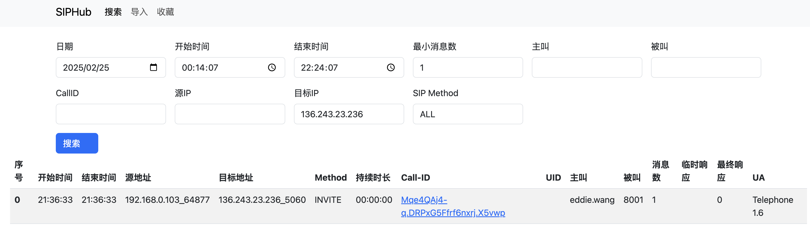
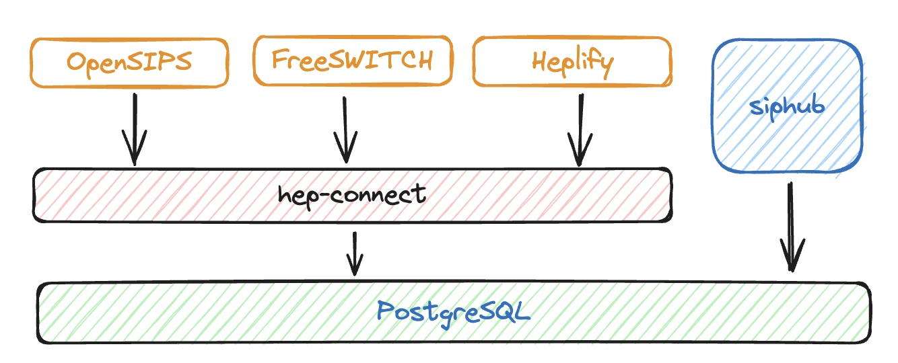

# siphub功能介绍

> 本项目基于 https://github.com/wangduanduan/siphub 修改。


# 截图

**搜索页面展示**




**时序图展示页面**

- 点击时序图的连线，对应原始消息会滚动到界面可视区域
- 点击原始消息，同时也会高亮对应连线，并滚动到可视区域
- 所有请求消息使用实线
- 所有响应消息使用虚线
- 相同的SIP事务的线条颜色相同
- 时序图显示的内容为：`F序号 SIP请求/状态码 [原因] 信令时间差`


## 依赖

- MySQL

# 部署

## docker 部署

```shell
docker run -d --name=siphub \
    -e DBUser=root \
    -e DBPasswd=mypass \
    -e DBAddr=1.2.3.4 \
    -e DBPort=3306 \
    -e DBName=siphub \
    -e AuthSecret=please-change-me \
    -e dataKeepDays=10 \
    -p 3000:3000 \
    siphub:latest
```

## 构建
```shell
docker build -t siphub:v1 . --push
```

**启动环境变量说明**

- DBUser: 数据库用户名， 默认wangduanduan
- DBPasswd: 数据库密码
- DBAddr: 数据库地址，默认127.0.0.1
- DBPort: 数据库端口，默认3306,
- DBName: 数据库名，默认siphub,
- LogLevel: 日志级别, 默认debug
- QueryLimit: 一次性查询的行数，默认10
- dataKeepDays: 保留最近几天的历史归档表，默认3，须为非负整数；当天的 `records` 主表另行保留。按 `timeZone` 的日期判断，例如9月30日设置为3时，保留9月27日起的历史表，删除更早的 `records_YYYYMMDD` 表；0表示不保留今天之前的历史表。临时表、备份表不参与清理，主表中的数据由每日分表任务归档后再参与清理。
- enableCron: 是否启用分表和清理任务，默认yes；设为no时，dataKeepDays不会触发清理
- cronTime: 分表和清理的执行时间，默认 `0 0 0 * * *`（每天零点）；配置在服务启动时读取，修改后需重启或重建容器，并在下一次定时任务执行时生效
- timeZone: 定时任务及历史表日期计算的时区，默认Asia/Shanghai
- AuthSecret: 登录态签名密钥，生产环境建议设置为随机字符串
- AuthSessionSeconds: 普通登录有效期，默认7200秒
- AuthRememberSeconds: 勾选记住我后的有效期，默认604800秒
- AuthMaxLoginAttempts: 登录失败锁定阈值，默认5次
- AuthLoginWindowSeconds: 统计登录失败次数的时间窗口，默认900秒
- AuthLockSeconds: 达到失败阈值后的锁定时长，默认900秒
- AuthCookieSecure: Cookie Secure策略，可选auto/always/never，默认auto
- TrustProxy: 是否信任反向代理转发头，可选yes/no，默认no。部署在HTTPS反向代理后建议设置为yes
- Port: Web服务监听端口，默认3000

# 架构图

- OpenSIPS、FreeSWITCH、Heplify 将SIP消息以HEP格式写入到hep-connect
- hep-connect将消息写入数据库， hep-connect部署文档参考 https://github.com/wangduanduan/hep-connect 
- siphub提供web查询界面，负责从数据库查询和展示SIP消息


